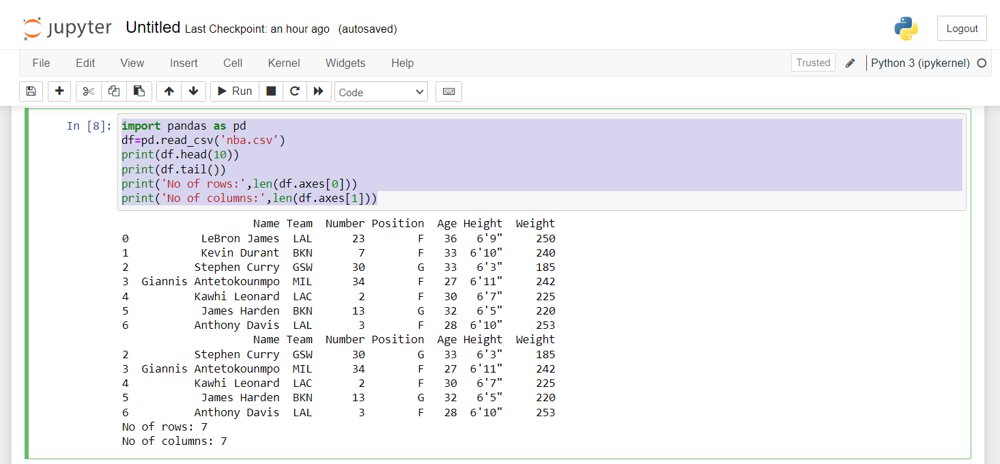

# Read-from-CSV

## AIM:
To write a python program to read the csv file and analyze it with pandas.
## ALGORITHM:
### Step 1:
Import pandas module and create corresponding object
### Step 2:
Create the Dataframe by reading the csv file.
### Step 3:
In the dataframe, print first 10 rows and last 5 rows.
### Step 4:
Display the Number of rows and Number of columns.
### Step 5:
End the program.
## PROGRAM:
```py
import pandas as pd
df=pd.read_csv('nba.csv')
print(df.head(10))
print(df.tail())
print('No of rows:',len(df.axes[0]))
print('No of columns:',len(df.axes[1]))
```
## OUTPUT:

## RESULT:
Thus, the program to read the csv file is created and executed successfully.